<div align="center">

<!-- ═══════════════════════════════════════════════════════════════ -->
<!-- 🚀 ANIMATED SPACESHIP BANNER                                   -->
<!-- ═══════════════════════════════════════════════════════════════ -->

<a href="https://github.com/Zestyssons">
  
</a>

<p style="font-family: monospace; color: #8b949e; font-size: 0.95rem; margin-top: -8px;">
  <b style="color: #00d4aa;">Python</b> · <b style="color: #0066ff;">Discord Bots</b> · <b style="color: #aa00ff;">Lavalink</b> · <b style="color: #f5a800;">Full-Stack</b>
</p>

<p style="font-family: monospace; color: #8b949e; font-size: 0.82rem;">
  🇩🇴 San Francisco de Macorís, R.D. &nbsp;|&nbsp; 🎓 UASD — Informática (3er semestre) &nbsp;|&nbsp; 🔐 CCA Certified
</p>

<!-- ─── STATUS BADGES ─── -->
<a href="https://github.com/Zestyssons?tab=repositories"></a>
<a href="https://zestysson-glizh.hf.space"></a>
<a href="https://github.com/Zestyssons?tab=repositories&sort=stargazers"></a>
<a href="https://github.com/Zestyssons"></a>

</div>

---

## <code style="color: #00d4aa;">> </code><span style="font-family: monospace; color: #c9d1d9;">whoami</span>

```text
┌─────────────────────────────────────────────────────────────────┐
│  Cristopher Mora Vargas                                         │
│  Técnico en Soporte y Ciberseguridad | Est. Informática UASD   │
│                                                                 │
│  > Building full-stack systems that bridge Discord & Web.       │
│  > Obsessed with real-time audio, WebSocket architecture,      │
│    and making things that just work.                            │
│  > Currently: Glizh — the music bot that does it all.          │
└─────────────────────────────────────────────────────────────────┘
```

---

## <code style="color: #00d4aa;">> </code><span style="font-family: monospace; color: #c9d1d9;">ls ./projects</span>

<table>
<tr>
<td width="50%" valign="top">

### 🔊 <span style="color: #f5a800;">Glizh</span>
> Discord Music Bot + Web Dashboard

Full-stack system: **Flask** backend, **WebSocket** real-time control, **Lavalink** audio engine, deployed on **HuggingFace Spaces** with Docker.

**Stack:** Python · Flask · WebSocket · Lavalink · SCSS · Docker

```bash
Features:
  ├── 🎵 Queue management via web UI
  ├── 🔐 Discord OAuth2 login
  ├── 📱 Responsive dashboard (CSS Grid)
  ├── ⚡ Real-time playback sync
  └── 🎨 Cinematic lobby (CRT, glitch, particles)
```

<a href="https://zestysson-glizh.hf.space"></a> <a href="https://github.com/Zestyssons/Glizh"></a>

</td>
<td width="50%" valign="top">

### 🤖 <span style="color: #0066ff;">OCI Bot</span>
> Oracle Cloud Infrastructure Provisioner

Automated VM creation on OCI with auto-detection of availability domains, retry logic, and error handling.

**Stack:** Python · OCI SDK · SSH · Bash

```bash
Capabilities:
  ├── 🔍 Auto-detect available domains
  ├── 🖥️ Provision Ubuntu 24.04 ARM64 VMs
  ├── 🔄 Retry logic (60 attempts, 60s wait)
  ├── 🔐 SSH key management
  └── 📊 Resource cleanup on failure
```

<a href="https://github.com/Zestyssons"></a>

</td>
</tr>
</table>

---

## <code style="color: #00d4aa;">> </code><span style="font-family: monospace; color: #c9d1d9;">cat ./skills.json</span>

<div align="center">

<!-- ═══ PRIMARY SKILLS ═══ -->
<table>
<tr>
<td align="center" width="90">
  
  <br><sub><b>Python</b></sub>
</td>
<td align="center" width="90">
  
  <br><sub><b>JavaScript</b></sub>
</td>
<td align="center" width="90">
  
  <br><sub><b>HTML5</b></sub>
</td>
<td align="center" width="90">
  
  <br><sub><b>CSS3 / SCSS</b></sub>
</td>
<td align="center" width="90">
  
  <br><sub><b>Docker</b></sub>
</td>
<td align="center" width="90">
  
  <br><sub><b>Git</b></sub>
</td>
</tr>
</table>

<!-- ═══ SECONDARY / TOOLS ═══ -->
<table>
<tr>
<td align="center" width="90">
  
  <br><sub><b>Bash</b></sub>
</td>
<td align="center" width="90">
  
  <br><sub><b>Firebase</b></sub>
</td>
<td align="center" width="90">
  
  <br><sub><b>Flask</b></sub>
</td>
<td align="center" width="90">
  
  <br><sub><b>Discord.py</b></sub>
</td>
<td align="center" width="90">
  
  <br><sub><b>Linux</b></sub>
</td>
<td align="center" width="90">
  
  <br><sub><b>VS Code</b></sub>
</td>
</tr>
</table>

<!-- ═══ CYBERSECURITY ═══ -->
<table>
<tr>
<td align="center" width="90">
  
  <br><sub><b>Windows</b></sub>
</td>
<td align="center" width="90">
  
  <br><sub><b>Ubuntu</b></sub>
</td>
<td align="center" width="90">
  
  <br><sub><b>OCI / Cloud</b></sub>
</td>
<td align="center" width="90">
  
  <br><sub><b>Nginx</b></sub>
</td>
<td align="center" width="90">
  
  <br><sub><b>SQLite</b></sub>
</td>
<td align="center" width="90">
  
  <br><sub><b>SSH</b></sub>
</td>
</tr>
</table>

</div>

---

## <code style="color: #00d4aa;">> </code><span style="font-family: monospace; color: #c9d1d9;">cat ./certifications.log</span>

<div align="center">

| Date | Certification | Issuer | Status |
|:---:|:---|:---|:---:|
| Jun 2026 | **Cybersecurity Certification Associate (CCA)** | Certiplus LLC | ✅ Valid → Jun 2029 |
| Jan 2026 | **Ciberseguridad — Nivel Intermedio** (860h) | INDOTEL / BID / Cymetria | ✅ |
| Nov 2024 | **Operaciones Básicas de Ofimática** (200h) | INFOTEP | ✅ |
| 2021 | **Reparación de Computadoras** | INFOTEP | ✅ |

</div>

---

## <code style="color: #00d4aa;">> </code><span style="font-family: monospace; color: #c9d1d9;">npx github-readme-stats --username Zestyssons --theme github_dark</span>

<div align="center">

<a href="https://github.com/Zestyssons"></a>
<a href="https://github.com/Zestyssons"></a>

</div>

<div align="center">

<a href="https://github.com/Zestyssons"></a>

</div>

---

## <code style="color: #00d4aa;">> </code><span style="font-family: monospace; color: #c9d1d9;">ss -tlnp | grep social</span>

<div align="center">

<a href="https://github.com/Zestyssons"></a>
<a href="https://discord.gg/BB2Kpg8hqj"></a>
<a href="mailto:cristophermoravargas1@gmail.com"></a>
<a href="https://zestysson-glizh.hf.space"></a>
<a href="https://top.gg/bot/769015435923292180"></a>

</div>

---

<div align="center">

```
 ██████╗██████╗  █████╗ ██╗   ██╗███████╗██╗  ██╗
██╔════╝██╔══██╗██╔══██╗╚██╗ ██╔╝██╔════╝██║  ██║
██║     ██████╔╝███████║ ╚████╔╝ ███████╗███████║
██║     ██╔══██╗██╔══██║  ╚██╔╝  ╚════██║██╔══██║
╚██████╗██║  ██║██║  ██║   ██║   ███████║██║  ██║
 ╚═════╝╚═╝  ╚═╝╚═╝  ╚═╝   ╚═╝   ╚══════╝╚═╝  ╚═╝
```

<sub style="font-family: monospace; color: #8b949e;">
  Built with 💛 by <a href="https://github.com/Zestyssons" style="color: #00d4aa; text-decoration: none;">Cristopher Mora Vargas</a> ·
  <a href="https://github.com/Zestyssons/Zestyssons" style="color: #8b949e; text-decoration: none;">Zestyssons/Zestyssons</a>
</sub>

</div>
